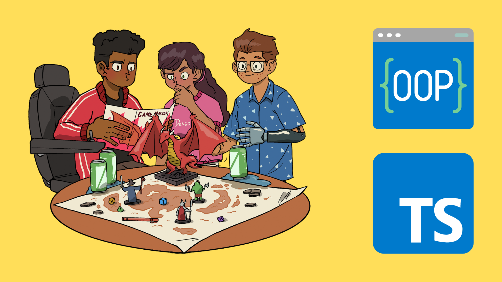

# :game_die: Trybers and Dragons :dragon:

## :page_with_curl: About/Sobre

  
<strong>:us: English</strong>
 

TypeScriot, OOP (Object-Oriented Programming) and SOLID project developed by [Raphael Martins](https://www.linkedin.com/in/raphaelameidamartins/) at the end of Unit 26 ([Back-end Development Module](https://github.com/raphaelalmeidamartins/trybe_exercicios/tree/main/3_Desenvolvimento-Back-end)) of Trybe's Web Development course. I was approved with 100% of the mandatory and optional requirements met.

We had to create classes, interfaces and types for a _Dungeons and Dragons-style_ RPG game using OOP and SOLID principles
 

  
<strong>:brazil: Português</strong>
 

Projeto de TypeScript, POO (Programação Orientada a Objetos) e SOLID desenvolvido por [Raphael Martins](https://www.linkedin.com/in/raphaelameidamartins/) ao final do Bloco 27 ([Módulo Desenvolvimento Back-end](https://github.com/raphaelalmeidamartins/trybe_exercicios/tree/main/3_Desenvolvimento-Back-end)) do curso de Desenvolvimento Web da Trybe. Fui aprovado com 100% dos requisitos obrigatórios e opcionais atingidos.

Tivemos que criar classes, interfaces e tipos para um jogo de RPG estilo _Dungeons and Dragons_ utilizando príncipos de POO e Solid.
 

## :man_technologist: Developed Skills/Habilidades Desenvolvidas

  
<strong>:us: English</strong>
 

* Create classes and abstract classes and methods
* Define types and interfaces
* Use OOP concepts such as Abstraction, Encapsulation, Inheritance, Composition and Polymorfism
* Use SOLID principles, such as Single Responsability, Open/Closed, Dependency Inversion, Substitution (Liskov) and Interface Segregation
 

  
<strong>:brazil: Português</strong>
 

* Criar classes e classes e métodos abstratas
* Definir types e interfaces
* Utilizar conceitos de POO como: Abstração, Encapsulamento, Herança, Composição e Polimorfismo
* Utilizar princípios de SOLID como: Responsabilidade Única, Aberto/Fechado, Inversão de dependência, Substituição de Liskov e Segragação de Interfaces
 

## :hammer_and_wrench: Tools/Ferramentas

* TypeScript
* OOP (Object-Oriented Programming)
* SOLID

## :trophy: Grade/Nota

